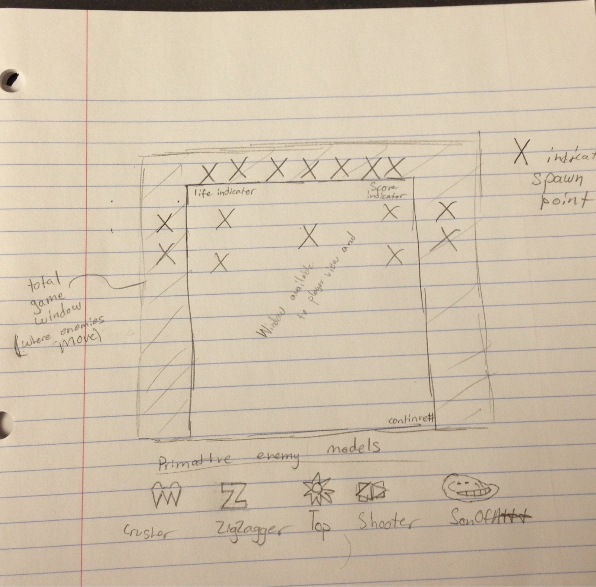

#Just Another ShootEmUp (JASEU)
My game is going to be a simple "Shoot em' up" style game. This type of gmae follows a top down scroller where the player controls
a spaceship or other type of craft that can shoot at other enemy spaceships.

#Enemy types (i.e. things)
+ Crusher(5 pts)- An enemy that only moves in vertical lines. Looks like a bunch of spikes.
+ ZigZagger(10 pts)- An enemy that moves in diagonal lines. Looks like an orange letter Z.
+ Tops(10 pts)- An enemy that moves in in progressively larger circles. Looks like a sunflower
+ Shooters(12 pts)- An enemy that moves in a horizontal line from one side of the screen to the other. Looks like a space ship
+ SonOfA***(50 pts)- An enemy that moves in a random direction and very quickly. Looks like a trollface.
  
#Gameplay
Gameplay consists of the basic use of W A S D or arrow keys to move your ship across the screen. When the spacebar, F key, or enter key is pressed a 
projectile will fire from the front of the spaceship. Player lives are tracked by a simple text object in the top of the screen. They the player
ship is hit by a projectile or enemy unit the play loses a life.  If a player scores 500 points they will gain another life. The player starts
with 3 lives. As time goes on the game will get progressively harder.

#Scoring
Score increases incrementally as time goes on (1 point every tick, tick interval increases over time). Points are also gained by destroying enemies.

#Layout

